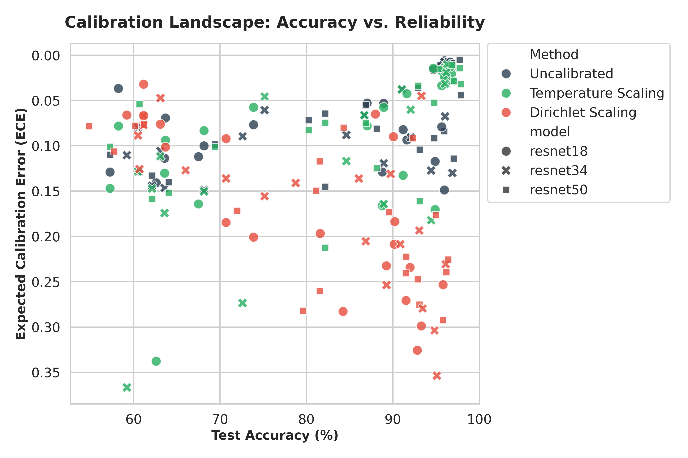
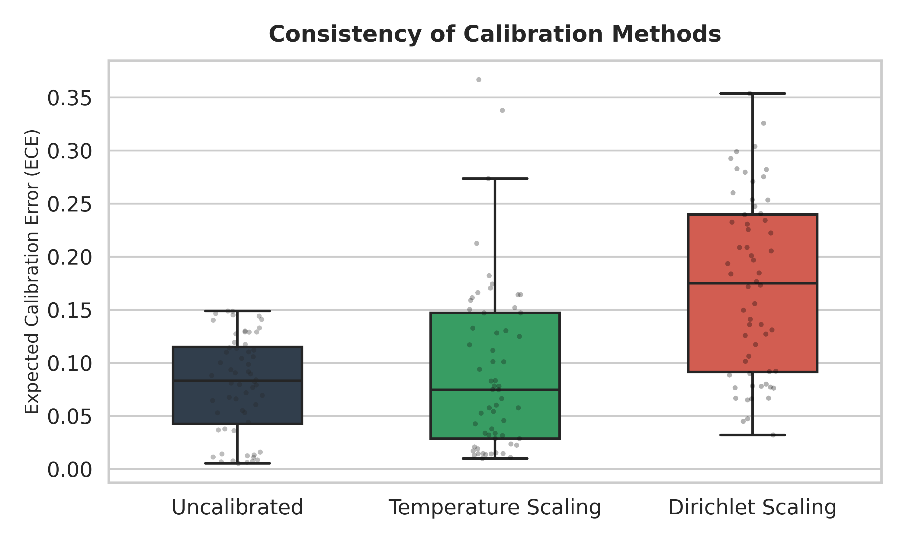
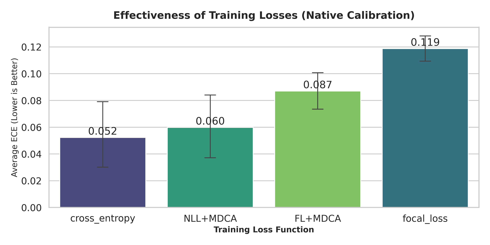

# Medical Model Calibration: Trustworthy AI for Medical Imaging

## Project Overview

In high-stakes domains like medical imaging, high accuracy is not enough. A model must be **calibrated**: its predicted confidence (e.g., "99% sure") must reflect its actual probability of correctness. An overconfident AI that misdiagnoses a tumor is dangerous.

This project implements a comprehensive, end-to-end pipeline to evaluate and improve the reliability of Deep Learning models. We conducted a rigorous comparative study across **180 experiments** (5 datasets, 3 architectures, 4 loss functions, 2 calibration techniques) to determine the most effective strategy for building trustworthy medical AI: **Train-Time Regularization** vs. **Post-Hoc Scaling**.

## Key Findings & Analysis

Our analysis reveals that **preventing miscalibration during training** is significantly more effective than trying to fix it post-hoc.

### 1. The Calibration Landscape

*Figure 1: The Accuracy-Reliability Landscape across 60 experimental runs. Models trained with MDCA regularization (Dark Blue) consistently occupy the "Ideal Region" (High Accuracy, Low Error), significantly outperforming post-hoc Dirichlet Scaling (Red).*

### 2. Consistency of Methods

*Figure 2: Distribution of Expected Calibration Error (ECE). Our training-based approach yields the lowest median error and highest consistency. Post-hoc Dirichlet scaling introduces massive variance, often degrading model reliability due to overfitting on small medical validation sets.*

### 3. Impact of Training Objectives

*Figure 3: Impact of loss functions on native model calibration. Integrating the MDCA regularizer (NLL+MDCA, FL+MDCA) significantly lowers the native calibration error compared to standard Cross-Entropy or Focal Loss.*

**Verdict:** The combination of **Focal Loss + MDCA** yielded the state-of-the-art result: **97.8% Accuracy** with minimal calibration error, removing the need for complex post-processing.

## Key Features

* **Advanced Loss Functions:** Implementations of **MDCA (Multi-Class Difference in Confidence and Accuracy)**, Focal Loss, and combined objectives.
* **Post-Hoc Calibration Suite:** Integrated modules for **Temperature Scaling** (LBFGS optimized) and **Dirichlet Scaling** (Matrix Scaling).
* **Publication-Ready Visualization:** Automated generation of Reliability Diagrams, ECE Landscapes, and Comparative Boxplots.
* **Robust Data Pipeline:** Custom dataloaders designed to handle diverse medical imaging directory structures.


## Installation

Clone the repository:
```bash
git clone https://github.com/praakul/medicalModelCalibration
cd medicalModelCalibration
```

Install Dependencies:
```bash
pip install -r requirements.txt
```

(Core stack: PyTorch, Torchvision, Pandas, NumPy, Scikit-Learn, Seaborn)

## 💻 Usage

### 1. Training (`train.py`)

Run this command to train the model with particular arguments.

**Example:**
```bash
python train.py \
  --dataset_path "data/Brain_tumour_dataset" \
  --model resnet50 \
  --num_classes 4 \
  --loss "FL+MDCA" \
  --epochs 50
```

**Arguments:**

| Argument | Type | Default | Description |
|----------|------|---------|-------------|
| `--dataset_path` | str | Required | Path to the dataset root directory. |
| `--model` | str | `resnet18` | Architecture: `resnet18`, `resnet34`, `resnet50`. |
| `--num_classes` | int | Required | Number of classes in the dataset. |
| `--loss` | str | `cross_entropy` | Loss function: `cross_entropy`, `focal_loss`, `NLL+MDCA`, `FL+MDCA`. |
| `--epochs` | int | `50` | Number of training epochs. |
| `--batch_size` | int | `32` | Training batch size. |
| `--learning_rate` | float | `0.001` | Initial learning rate. |
| `--beta` | float | `5.0` | Weight for MDCA term (if using `+MDCA`). |
| `--gamma` | float | `2.0` | Gamma parameter for Focal Loss. |

### 2. Calibration (`calibration.py`)

Use this script to apply post-hoc calibration (Temperature Scaling or Dirichlet Scaling) to a trained model checkpoint.

**Example:**
```bash
python calibration.py \
  --checkpoint_path "checkpoints/Brain_tumour_dataset/.../model_best.pth" \
  --dataset_path "data/Brain_tumour_dataset" \
  --model_name resnet50 \
  --num_classes 4 \
  --method temperature
```

**Arguments:**

| Argument | Type | Default | Description |
|----------|------|---------|-------------|
| `--checkpoint_path` | str | Required | Path to the `.pth` file saved by `train.py`. |
| `--dataset_path` | str | Required | Path to the dataset used for training. |
| `--model_name` | str | Required | Architecture used in the checkpoint (`resnet18`, etc.). |
| `--num_classes` | int | Required | Number of classes in the dataset. |
| `--method` | str | Required | Method to apply: `temperature` or `dirichlet`. |
| `--Mu` | float | `0.0` | Regularization parameter (for Dirichlet scaling). |

## 🧬 Datasets

We utilized 5 diverse medical imaging datasets to ensure robust evaluation.

| Dataset | Classes | Train Imgs | Test Imgs | Class Labels |
|---------|---------|------------|-----------|--------------|
| Breast Ultrasound | 3 | 623 | 157 | Benign, Malignant, Normal |
| Skills Evaluation | 3 | 1,010 | 206 | Average, Good, Poor |
| Brain Tumour | 4 | 5,712 | 1,311 | Glioma, Meningioma, No Tumor, Pituitary |
| Chest X-Ray | 2 | 5,216 | 624 | Normal, Pneumonia |
| COVID-19 | 3 | 9,518 | 2,580 | COVID, Normal, Viral Pneumonia |


## Metrics Implemented

We track a comprehensive suite of metrics for every run:

**Performance:** Accuracy, Weighted F1-Score, Weighted AUC (One-vs-Rest).

**Reliability:**

* **ECE (Expected Calibration Error):** The weighted average gap between confidence and accuracy.
* **MCE (Maximum Calibration Error):** The worst-case gap in any single bin.
* **Reliability Diagrams:** Visual plots of Confidence vs. Accuracy.

---


## Acknowledgement

This is an attempt to extend and validate the work the work presented in the paper *A Stitch in Time Saves Nine: A Train-Time Regularizing Loss for Improved Neural Network Calibration*
Ramya Hebbalaguppe, Jatin Prakash, Neelabh Madan, Chetan Arora; Proceedings of the IEEE/CVF Conference on Computer Vision and Pattern Recognition (CVPR), 2022, pp. 16081-16090